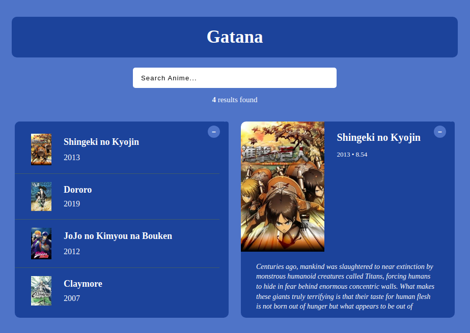

# Gatana App

A spartan UI for an anime database web application.

The name 'Gatana' derives from _Namakura Gatana_ (なまくら刀) (1917), which is one of the earliest theatrically released anime.

## Table Of Contents

- [Demo](#demo)
- [Introduction](#introduction)
- [Features](#features)
- [Stack](#stack)

## Demo

https://gatana.vercel.app/

## Introduction

The objective is to learn in-depth about React component.

## Features

- Search box, results list box, and details box:

  

## Stack

- React 18
- Vite 5
